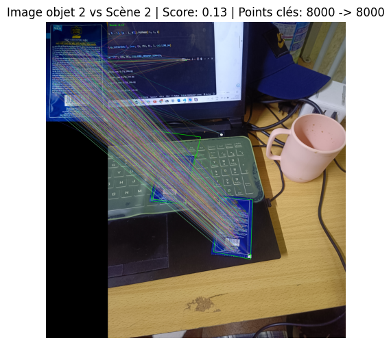
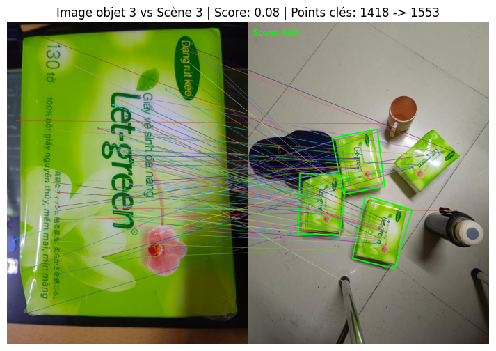
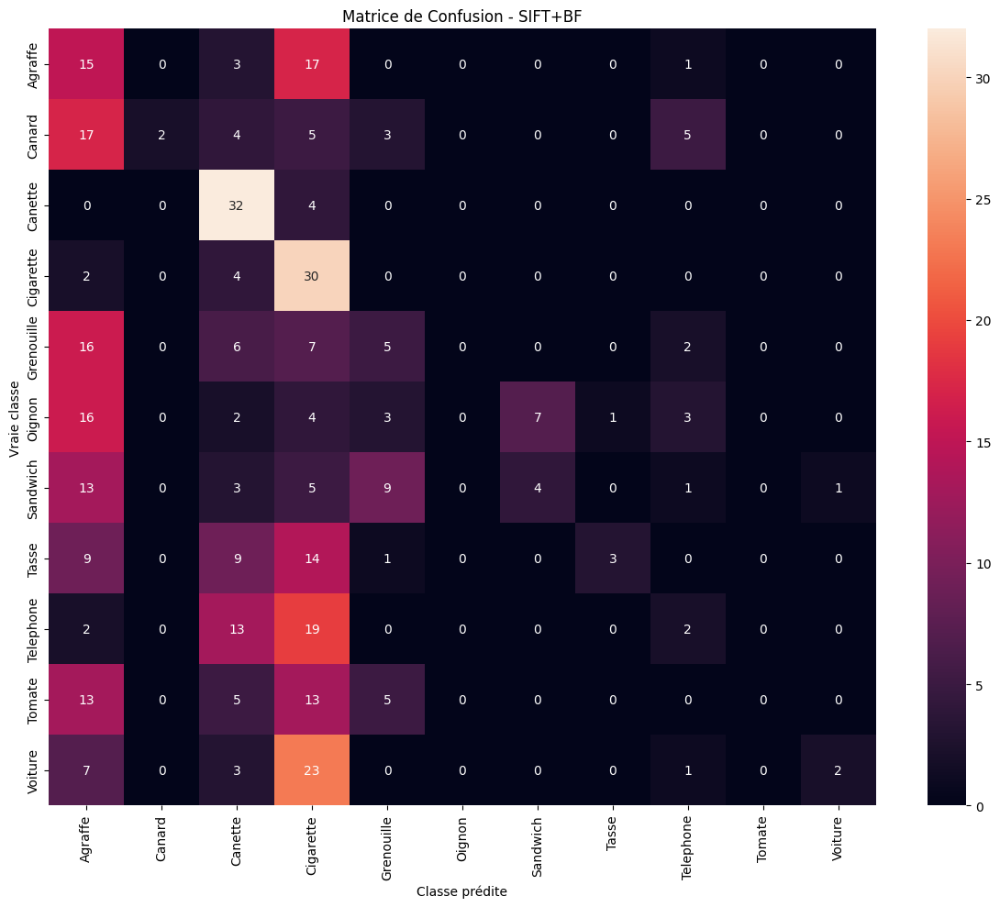
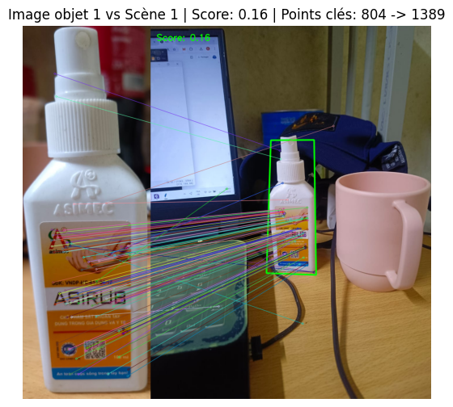

# Détection et reconnaissance d’objets avec SIFT

## Contexte et motivation

La vision par ordinateur est un champ clé de l’intelligence artificielle, avec des applications allant des véhicules autonomes à la biométrie en passant par l’analyse d’images.  
Dans ce projet, j’ai travaillé sur deux aspects fondamentaux :

1. **Détection d’objets** : localiser un objet précis dans une scène complexe.  
2. **Reconnaissance d’objets** : identifier un objet inconnu en le comparant à une base de référence.

Ce travail s’appuie sur l’algorithme **SIFT (Scale-Invariant Feature Transform)**, choisi pour sa robustesse face aux changements d’échelle, de rotation et de luminosité.

---

## Méthodologie

- **Détection** : extraction de descripteurs SIFT, appariement avec FLANN, filtrage par le *ratio test* de Lowe et localisation via homographie. Un clustering (**DBSCAN**) a ensuite permis d’identifier plusieurs occurrences d’un même objet.  
- **Reconnaissance** : classification basée sur le score de similarité entre les descripteurs de l’image test et ceux de la base d’apprentissage.  

Les expériences ont été menées sur un ensemble de **396 images réparties en 11 classes d’objets**.

---

## Résultats et analyse

- **Détection** : les objets sont correctement localisés dans la plupart des scènes lorsque le nombre de correspondances est suffisant.  
- **Reconnaissance** :  
  - Précision globale : **54,2 %**  
  - Classes bien reconnues : *Canette (100 %), Cigarette (88,9 %), Canard (81,8 %)*  
  - Classes problématiques : *Sandwich (22,2 %), Grenouille (28 %), Tomate (24,1 %)*  

Ces résultats confirment la pertinence des descripteurs locaux mais soulignent aussi leurs limites face aux variations d’apparence et aux confusions visuelles entre certaines catégories.

---

## Enseignements et perspectives

Ce projet m’a permis de :  
- Approfondir la maîtrise des méthodes classiques en vision par ordinateur (SIFT, FLANN, DBSCAN).  
- Identifier les conditions dans lesquelles ces approches sont efficaces, et leurs limites.  
- Mettre en évidence l’intérêt d’approches récentes basées sur le *deep learning* (CNN, transformers), notamment pour améliorer la robustesse et la généralisation.

**Perspectives :**
- Optimisation des paramètres de clustering et des seuils de correspondance.  
- Comparaison avec des méthodes d’apprentissage profond.  
- Applications à des scénarios concrets (mobilité intelligente, détection des fossiles, perception images).

---

## Technologies utilisées

- Python  
- OpenCV  
- NumPy  
- Matplotlib  
- Scikit-learn  

---

## Contenu du dépôt

- `Tp_VO.ipynb` → Notebook avec le code et les expérimentations.  
- `Rapport__Vision_par_Ordinateur_TP1.pdf` → Rapport complet détaillant la démarche et les résultats.  

---

## Auteurs

- David Lutala Lushuli  
- Christine Toumba Ngongo  

**Encadrante :** Nguyen Thi Oanh  
**Année universitaire :** 2024–2025
